# Patchnotes 23.12.2022

## [Items]
- Added a bunch of new shirts *(probably for some future event as reward?)*

  + Aleatory(M/F)

  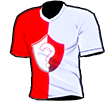 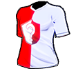

  + Beloved(M/F)

  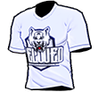 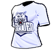

  + Demonshell(M/F)

  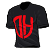 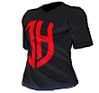

  + Dimex(M/F)

  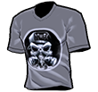 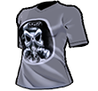

  + Foxy(M/F)

  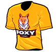 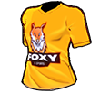

  + Frenesi(M/F)

  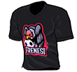 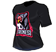

  + GPower(M/F)

  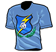 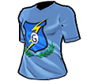

  + Kings(M/F)

  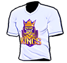 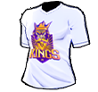

  + Laranjinhas(M/F)

  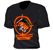 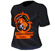

  + Lion(M/F)

  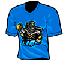 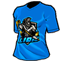

  + P0nder(M/F)

  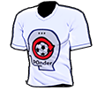 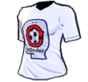

  + Peleadores(M/F)

  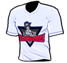 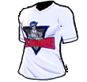

  + Sacodepancada(M/F)

  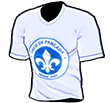 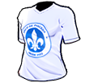

  + Schicksal(M/F)

  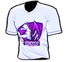 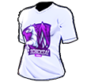

  + Superstars(M/F)

  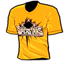 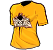

  + Turmadobairro(M/F)

  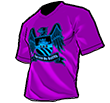 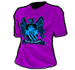

  + Vanguard(M/F)

  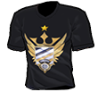 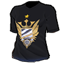

## [Bug Fixes]
1. Skills equipped in 1on1 mode are valid in football mode
2. Skills equipped by the captain in classic mode are displayed in 1on1 mode
3. 1on1 mode skills do not work correctly for non-captain characters
4. TeamSkill interface does not work correctly in 1on1 mode under certain circumstances
5. Optimize the equipment logic of skills and Freestyle
6. Optimization of in-game skill display