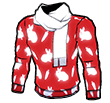
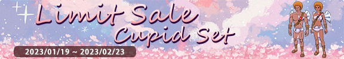

# Patchnotes 19.01.2023

## [Characters]
*They changed the skills of the 2 new characters, their original skills are ~~crossed out~~*

- Added [Crimson the Reaper](http://fsf.hogacn.com/h/guide/h/guide/juesejieshao/2021/0824/917.html)

> - Probably ~~strong ALL~~ decent CMF/DMF (can be played as either, depending how good the skills 2/3 are)
> - Height: 174cm
> - Bonus Stats: Dribble Tech, Kick Defense
> - Skills
>   1. ~~Reduces ball touch distance while dribbling.~~
>
>      Increases the max range of "Direct Return Pass" (DM, CM, AM, SM only).
>   2. ~~Increases speed of all passes.~~
>
>      While losing reduces ball touch range while dribbling in opponents side.
>   3. ~~Increased height when clearing or passing the ball in the air.~~
>
>      In 2nd half of match increases tackle range against a pass.
- Added [Dr.Stein](http://fsf.hogacn.com/h/guide/h/guide/juesejieshao/2021/0223/799.html)

> - Probably ~~broken DF~~ decent CF (tall as fk and decent skills)
> - Height: 197cm
> - Bonus Stats: Jump, Shot Accuracy
> - Skills
>   1. ~~Increases run and turning speed while defending.~~
>
>      In 1st half of match increases ShotAcc of headers.
>   2. ~~Increases range, success rate and araising speed of tackles.~~
>
>      If tied, increases dash speed while dribbling.
>   3. ~~Increases speed and max distance of lob passes from own half AND delays the ball marker for the opponent.~~
>
>      While losing, increases ShotPow while dribbling in the penalty area.

## [Items]
- Added a new capsule for Crimson the Reaper and Dr.Stein  
*(replacing the Golden Gordon and Dion capsule as predicted. if the progress on it resets as well i do not know)*

  
- Violet and Edo have been removed from the Extraordinary Academy Capsule
- Golden Gordon and Dion were not added to it either

- Added fragments for Crimson the Reaper and Dr.Stein

     

- Added some kind of box *(probably for the rabbit year event)*

  

- Added Lucky Coins as a new currency *(can be used to buy char/card capsules, not sure how many coins per capsule)*

  

- Added the Dominics Gym Pass *(can be used for one-click training instead of spending coins)*

  

- Added 2 new items *(probably as rewards for the rabbit year event)*

  + Rabbit Bag(M/F)

  

  + Rabbit Top(M/F)

   

- Added the Cupid Outfit

   

- and the items which were not already part of the client

   

## [Events]
- Removed the Online Event again *(receiving scout points & points for beeing logged in)*
- The "Pick a Mystery Card" Event progress has been reset
- Season Pass (19.01 - March) *(finish daily & weekly tasks to gain exp, which unlocks rewards. can spend coins to lvl up instead of doing tasks)*

  

- Season Pass 1 Rewards:
  + 112.5k Points
  + 75 Scout EXP
  + 45x D Cards
  + 5x Lucky Coins
  + 5x 1D Diamond Pass  

- Season Pass 2 Rewards: *(can be unlocked for 10800 coins)*
  + 562.5k Points
  + 225 Scout EXP
  + 5x A Cards
  + 10x B Cards
  + 15x C Cards
  + 15x Lucky Coins
  + 5x 3D Diamond Pass
  + 8x Dominics Gym Pass
  + 150 A Class Character Fragments
  + 50 Special Character Fragments

- Crimson the Reaper & Dr. Stein Event (19.01 - 23.02) *(Capsule might be only available during this event)*

  
- Valentines Day Sale (19.01 - 22.02)

  
- Rabbit Year (22.01 - 06.02)

  
- Carnival Event (10.02 - 22.02)

  

## [Features]
- Character Exchange: The ability to trade character fragments for either character level ups OR the character itself. *(Patchnotes say it requires 10 fragments, but its 150 which can be traded for a character)*
- New Login Screen

  

## [Adjustments]
- Reduced the distance from the offside line to the last player
- Adjusted the effect of the "Powerful Dipping Shot" for different Secondary Positions *(e.g. DM has it LVL 1, ST has it LVL 2. )*
- Added button settings for switching to a specific character and handle settings in 1v1 Mode *(which is still disabled)*