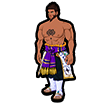
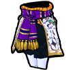
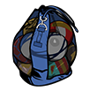
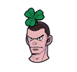
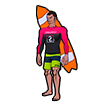
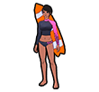
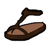
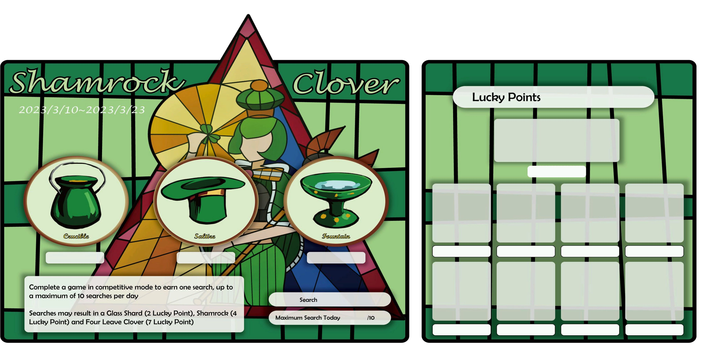
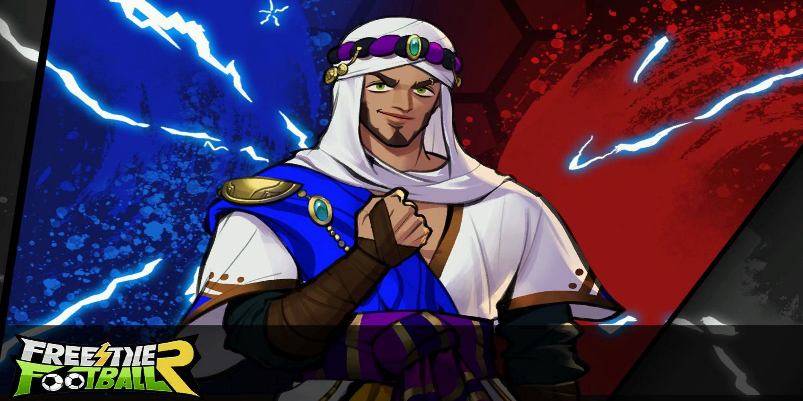

# Patchnotes 23.02.2023

## [Characters]
*They changed the skills of the 2 new characters, their original skills are ~~crossed out~~*

- Added [Caesar](http://fsf.hogacn.com/h/guide/h/guide/juesejieshao/2022/0427/1100.html)

> - Probably ~~strong SS/AM~~ decent ST (EffShotRate is OP, 2nd skill useless, 3rd pretty good, amazing bonus stats)
> - Height: 181cm
> - Bonus Stats: Shot Tech, Shot Accuracy
> - Skills
>   1. ~~Increases curve of the Curve Shot Skill.~~
>
>      Increases the effective shot rate of "" (ST only) *(probably Spin Dip or Rush Shot)*
>   2. ~~Reduces touch distance and increases running speed while dribbling.~~
>
>      In 2nd half of match increases ground pass speed.
>   3. ~~Increases ground pass speed.~~
>
>      While losing, increases dash speed without the ball.
- Added [Maid Beta](http://fsf.hogacn.com/h/guide/h/guide/juesejieshao/2020/1222/756.html)

> - Probably ~~very strong CB/SW~~ alright DF (1st skill useless, decent height)
> - Height: 188cm
> - Bonus Stats: Stamina, Ground Pass
> - Skills
>   1. ~~Greatly increases interception distance and success rate against dribbles.~~
>
>      In 1st half of match increases effective shot rate of charged shots in the pen area.
>   2. ~~Increases height against air balls.~~
>
>      In 2nd half of match increases recovery rate while defending.
>   3. ~~Increases the speed of all pass types.~~
>
>      While losing and defending, increases success rate of tackles in own pen area.

- Added files and item icons regarding [Divine Kaiser/Caesar](http://fsf.hogacn.com/h/guide/h/guide/juesejieshao/2022/0427/1101.html) to the client *(he is potentially the next new S character)*

   

- Added lots of models and textures for all the existing characters of the chinese version to the client
e.g. Charlotte, Elias, Yann, Big Dog, ...
*(check https://github.com/Ichychi/fsfr-patchnotes/blob/main/characters/characters.md for reference)*

## [Items]
- Added a new capsule for Caesar and Maid Beta 
*(replacing the Crimson the Reaper and Dr.Stein capsule as predicted. if the progress on it resets as well i do not know)*

   *(also they forgot to change the name of the capsule)*
- Crimson the Reaper and Dr.Stein have not been added to the Extraordinary Academy Capsule
- Crimson the Reaper has been removed from the new capsule making her unobtainable

- Added fragments for Caesar and Maid Beta

     

- Added a "Package" item to the item shop which contains 21x Dominic Gym Pass, 45.000 EXP, 3x B Card, 10.000 points
*(It is currently bugged and not purchasable as they forgot to give it a price)*

  

- Added a new hair item *(probably as reward for the shamrock event)*

  + Clover Hair(M/F)

   

- Added the Beach Outfit

   

- Added a bunch of new items to the shop which were already part of the client
- Added a few completely new items

  + Some Shoe

  

  + Cowgirl Hair (F)

    

- Fixed the bug with the Female Rabbit Year Sweater item, which blocked players from saving stats on it

## [Events]
- Added the Online Event again *(receiving scout points & points for beeing logged in)*
- The "Pick a Mystery Card" Event progress has been reset
- Season Pass (19.01 - 23.03) Quests now give more Season EXP
- Caesar & Maid Beta Event (23.02 - 23.03) *(Capsule might be only available during this event)*

  
- Scout System Update Alice & Olivia *(350 Scout EXP per 75 Fragments)*

  
- Surfing Pack Sale (23.02 - 22.03)

  
- Shopping Plan (23.02 - 09.03) *(Play up to 20 Matches per Day)*

  
  + Rewards: *(The Scout EXP from this event are currently bugged and give 0 Scout EXP)*
  + Game  3: 2.000 Points
  + Game  5: 3.000 EXP
  + Game  8: 2 Scout EXP
  + Game 10: 3 Scout EXP
  + Game 13: 3.000 Points
  + Game 15: 3.000 EXP
  + Game 18: 5 Scout EXP
  + Game 20: 1 Lucky Coin

- Shamrock Clover Event (10.03 - 23.03)

  
  

## [Features]
- 1v1 Mode:
  + Has been re-added *(still has the same bugs it had when it got disabled)*
  + Logic of AI and the Goalkeeper Behavious has been adjusted
  + Characters will inherit their original stats and levels, but anything related to cards is disabled in this mode
  + Some Team Buff effects have been adjusted
  + The Interface has been adjusted
- New Login Screen

  

- Twitch Drops are planned
- A new button in the item locker has been added:
"Use all fragments" *(will probably open all characters fragments in the inventory at once)*