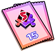
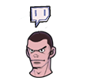
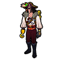
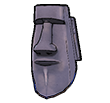
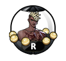
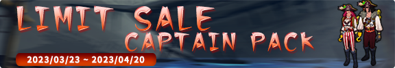
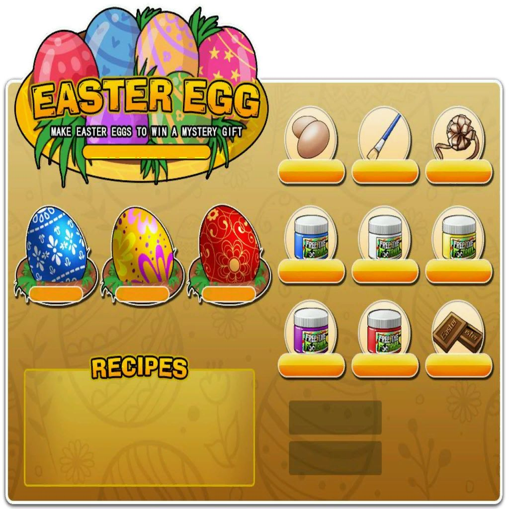
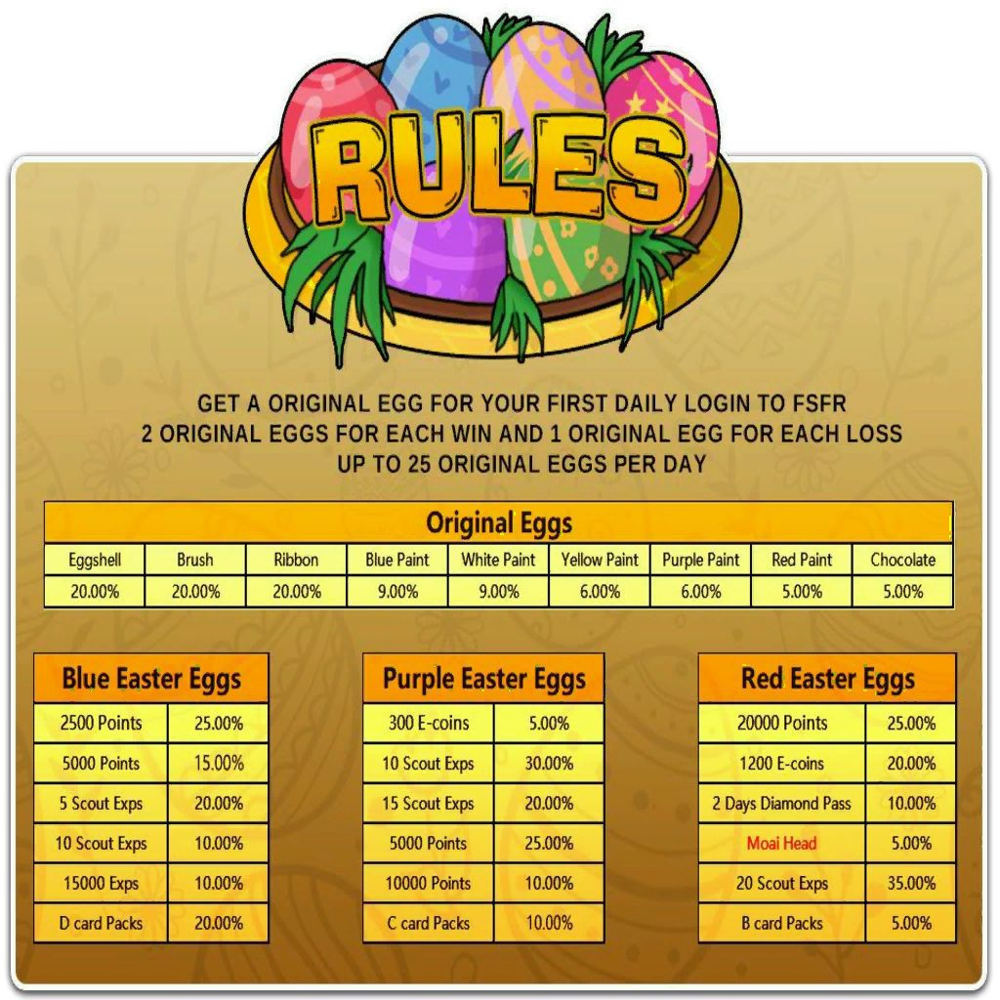
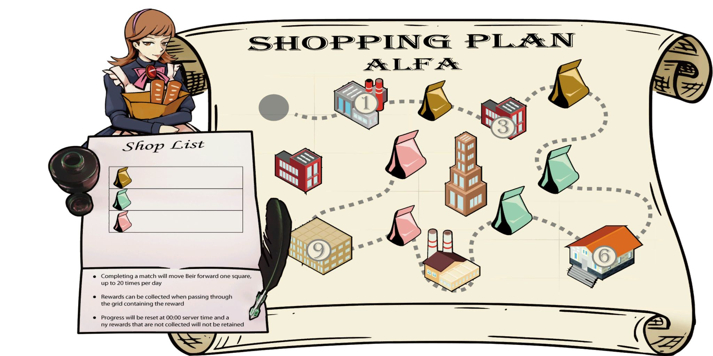
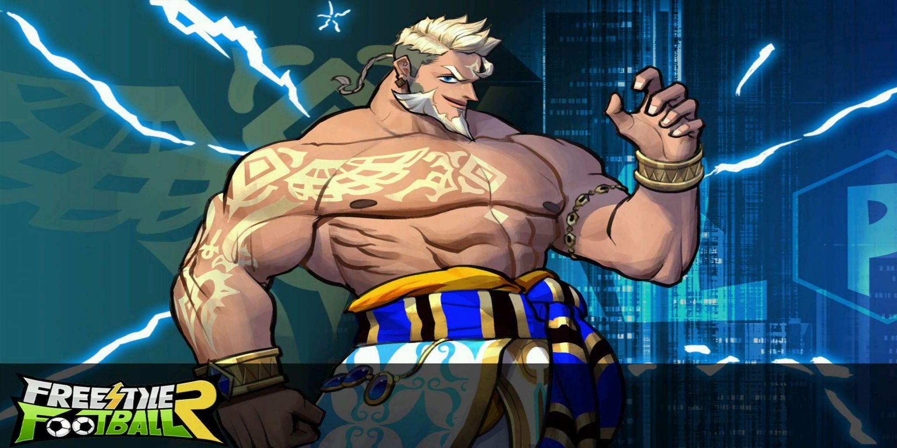

# Patchnotes 23.03.2023

## [Characters]
*They changed the skills of the 2 new characters, their original skills are ~~crossed out~~*

- Added [Arslan](http://fsf.hogacn.com/h/guide/h/guide/juesejieshao/2022/0628/1150.html)

> - Probably ~~crazy DF~~ decent SW (Great 1st and 3rd skill, 2nd is alright too, decent bonus stats)
> - Height: 181cm
> - Bonus Stats: Slide Tackle, Response
> - Skills
>   1. ~~Increases range and success rate of stand tackles.~~
>
>      Increases slide tackle range while using "Jockey" or "Careful Jockeying" (SW only).
>   2. ~~Increases ground pass speed of team members?!.~~
>
>      In 2nd half of match, increases passing speed in own half.
>   3. ~~While behind, increases success rate of steals against the ball holder by 80%.~~
>
>      In 2nd half of match, increases dash speed without ball while in own half.
- Added [Maid Alfa](http://fsf.hogacn.com/h/guide/h/guide/juesejieshao/2020/1028/712.html)

> - Probably ~~very good DF~~ alright DMF? (1st skill useless, 2nd skill strong, 3rd also decent, great bonus stats)
> - Height: 158cm
> - Bonus Stats: Run, Dribble Defense
> - Skills
>   1. ~~Increases run and turning speed while defending.~~
>
>      In 2nd half of match, increases ShotPower of small shots in pen area.
>   2. ~~Increases tackle success rate and arising speed.~~
>
>      In 1st half of match, reduces ball touch range.
>   3. ~~Increases body resistance type and strength.~~
>
>      When tied, increases slide and stand tackle.

- Added a new collection for Dr.Stein, Mail Beta and Maid Alfa *(Giving up to +15 ShotAcc, GroundPassSpeed and DribbleDefense)*

## [Items]
- Added a new capsule for Arslan and Maid Alfa 
*(replacing the Ceasar and Maid Beta capsule as predicted. if the progress on it resets as well i do not know)*

   *(also they forgot to change the name of the capsule)*
- Ceasar and Maid Beta have not been added to the Extraordinary Academy Capsule
- Ceasar has been removed from the new capsule making him unobtainable

- Added fragments for Arslan and Maid Alfa

   

- Added special fragment packs S and A *(dunno where theyre going to be obtainable from)*

   

- Added a the fragment pack for Dr.Stein, Maid Beta and Mail Alfa to the weekly discount

  

- Added 2 new hair items *(which are going to be part of twitch drops)*

  + Twitch Hair A (M/F)

   

  + Twitch Hair B (M/F)

   

- Added the Captain Outfit

   

- Added the Moai Head *(rare reward of the easter egg event)*

  

## [Events]
- Removed the Online Event again *(receiving scout points & points for beeing logged in)*
- The "Pick a Mystery Card" Event progress has been reset
- Arslan & Maid Alfa Event (23.03 - 20.04) *(Capsule might be only available during this event)*

  
- Easter Limited Return (23.03 - 20.04) *(Added capsules for Violet, Gordon and Crimson Reaper, and fked up the name for all of them)*

  
  
  
  
  
- Captain Pack Sale (23.03 - 20.04)

  
- New Season of Season Pass (23.03 - May) *(Same rewards, more diverse missions to get Season EXP)*

  
- Easter Egg (26.03 - 09.04) *(Play between 12 and 24 Matches per day for full rewards)*

  
  
  

- Shopping Plan Alfa (10.04 - 20.04) *(Play 20 matches per day)*

  
  

## [Features]
- New Login Screen

  

- More Twitch Drops are planned
- Club League Teaser for next patch *(probably)*

## [Adjustments]
- Added a price to the Training Pack A of 13.500 Coins *(not purchasable with e-coins)*
- Reduced the effect of Ellie's first skill *(barely noticable)*
- Reduced the duration of Liu's first skill from 60s to 30s *(RIP Liu 2023)*
- Adjusted ELO rules for matching teammates and opponents *(whatever that means)*
- Adjusted matching rules for 1v1 Mode *(when extending you play vs AI => game always counts as draw and no game stats are saved aka wins, goals, assists, ...)*
- Fixed a bug that could cause users to be unable to log in
- Made the lobby interface laggy *(tried to hotfix it on the next day, but it is still laggy, especially the character selection)*