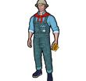
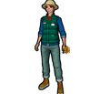
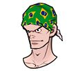
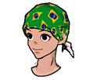

# Patchnotes 17.11.2022

## [Characters]
- Added [Ido](http://fsf.hogacn.com/h/guide/h/guide/juesejieshao/2021/0428/839.html)

- Added [Model Violet](http://fsf.hogacn.com/h/guide/h/guide/juesejieshao/2021/0630/871.html)

## [Items]
- Added some new glove?
- Added fragments for Ido and Model Violet
- Added some farmer outfit(M/F)

 
- Added new hair(M/F) for the worldcup event (Bandana with flag of each country)

 
- Added new capsule item for ido + model violet (which will probably replace the current one of the Wild characters)

## [Events]
- Turkey Run (most likely similar to the Jogging Event)

- Lucky Bingo

- World Cup Guess (17.11 - 21.12)

- Training Success Rate Up (24.11 - 21.12)

- Scout System Update (Kitsune + Kitsune Blue)

## [Features]
- [Team Make System](https://steamcommunity.com/games/1826980/announcements/detail/3467237196843897680)

## [Bug Fixes]
- Ellie's Specialty can be triggered in the wrong situation
- Ellie's Specialty does not work when some cards were equipped
- Google Forms is no longer available as a feedback channel to improve the efficiency of feedback processing
